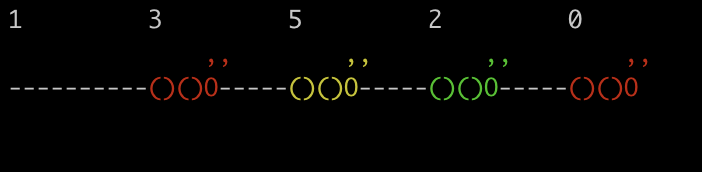

# LEM IN

## Prerequisites
* ncurces
* gcc (compiler)

## Description
Implementation of a pathfinding algorithm. Route ants in an ant colony using the shortest path.

## Overall Achievements


## File Structure
```
lem_in
│
│   author
│   Makefile
│   README.md
│   
└───docs
│
│   console_output.png
│   lem-in.en.pdf
│   overview.png
│   visual_output.png
│   viz_input.png
│
└───includes
│
│   lem_in.h
│
└───libft
│   │
│   └───includes (header file for libft library)
│
│   libft functions (from previous libft project)
│
└───maps (provided examples to test)
│
└───srcs (provided examples to test)
│
│   crawl.c
│   error.c
│   init.c
│   main.c
│   move.c
│   read.c
│   search.c
│   viz.c
│
└───tests (self made map examples for testing)
```
## Compiling and Executing
To compile use the following command line
```
make all
```
To execute the program use the following command line
```
./lem-in < tests/test.txt
```
This will output the resulting path that the ants would take


Note that you can replace "tests/test.txt" with any map you wish to use

To make use of a visualizer for this project, simply place the "##viz"" command within any of the map files i.e. looking at tests/test6.txt


Hence making use of any map containing the "##viz" command would result in a visual representation of the path the ants would take


